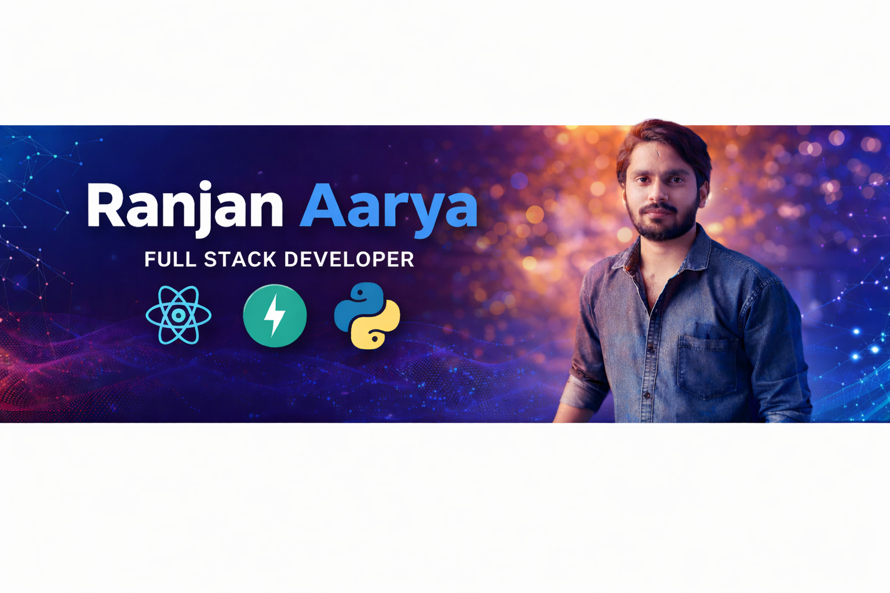

<!-- ===================== BANNER ===================== -->

  

<h1 align="center">Hi 👋 I'm Ranjan Aarya</h1>

  

---

## 👨‍💻 About Me

🚀 Full Stack Developer with strong skills in **React.js, FastAPI, and Python**  
💻 Passionate about building real-world web apps and APIs  
📊 Interested in Benchmarking, APIs, and Cloud Deployment  
🎯 Focused on continuous learning and improvement

---

## 🧠 Tech Stack

---

## 📌 Featured Projects

- 🛒 **Thekua Store** – Full Stack React + FastAPI E-Commerce
- 📝 **Todo App** – CRUD App using React + FastAPI
- 📘 **Blog API** – REST APIs built with FastAPI + SQLAlchemy
- 📊 **PII Detection Benchmark** – API accuracy & evaluation project

---

## 📊 GitHub Stats

---

## 🔥 GitHub Streak

---

## 📫 Connect With Me

---

⭐ **Thanks for visiting my profile!**

